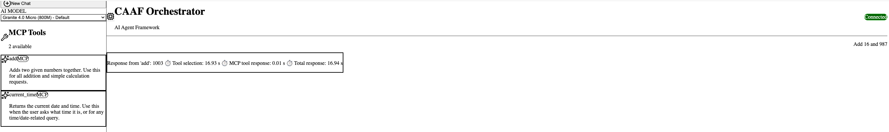
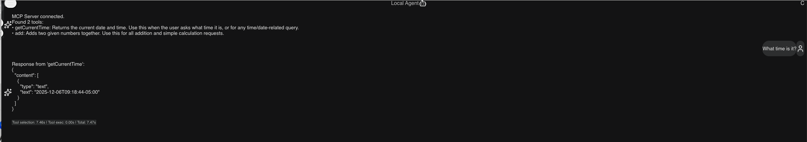
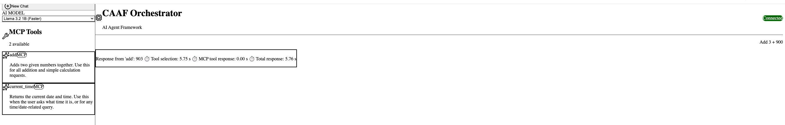
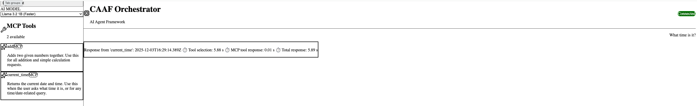

# CAAF MVP (Client-Side AI Agent Framework)

A browser-based AI agent framework built with React, TypeScript, and Transformers.js. This application runs AI inference directly in the browser and connects to Model Context Protocol (MCP) tools running locally for illustration purposes.

The project was created to explore the use of locally-running (open source) languge models and MCP servers. The primary goal is to accept a user prompt, leverage the language model to discern if an approprite MCP Tool is available and appropriate to use to respond or use the model itself. Various models were tested and the current version of the application includes two (references below).  While the Granite model from IBM seems to be the more accurate of the two, on a MacBook with an Apple M4 processor, it takes 20+ seconds to respond.  The Llama model responds faster (6+ seconds) but did not choose the correct tool as consistently as the Granite model did. 

While improved models and hardware will increase accuracy and performance over time, the prompts (both user and generated system prompts) are a significant piece of the puzzle. Perhaps additional manual and LLM-assisted tweaking of the prompts 

## 🚀 Features

- **In-Browser Inference**: Runs the `onnx-community/granite-4.0-micro-ONNX-web` model locally in your browser using [Transformers.js](https://huggingface.co/docs/transformers.js). No external API keys or local model runners (like Ollama/LM Studio) required for the chat model.
- **Additional Model**: You can also select the `onnx-community/Llama-3.2-1B-Instruct` model, which is available as an alternative for faster inference.
- **MCP Integration**: Connects to [Model Context Protocol](https://modelcontextprotocol.io/) servers to discover and execute tools.
- **Auto-Connect**: Automatically connects to the local MCP server on startup.
- **Modern UI**:
  - Vibrant, glassmorphism-inspired design.
  - Real-time progress bars for model downloading.
  - "Thinking..." indicators for AI processing.
  - Persistent sidebar with "New Chat" functionality.
- **Smart Tool Execution**: Parses tool responses to extract and display relevant results cleanly.
- **PWA Support**: Installable as a Progressive Web App for a native-like experience.

## 📸 Results

### Granite 4.0 Micro Model

**Granite: Add Tool Example**



**Granite: Current Time Tool Example**



### Llama 3.2 1B Model

**Llama 3.2: Add Tool Example**



**Llama 3.2: Current Time Tool Example**



## 🛠️ Tech Stack

- **Frontend**: React, TypeScript, Vite
- **Styling**: Tailwind CSS, Lucide React (Icons)
- **AI/ML**: `@huggingface/transformers` (Transformers.js)
- **Protocol**: `@modelcontextprotocol/sdk`
- **PWA**: `vite-plugin-pwa`

## 📦 Installation

1. **Clone the repository**
   ```bash
   git clone <repository-url>
   cd caaf-mvp
   ```

2. **Install dependencies**
   ```bash
   npm install
   ```

## 🏃‍♂️ Running the Application

### 1. Start the MCP Server
This application is designed to work with the MCP server from the [mcp-typescript-example](https://github.com/carljmosca/mcp-typescript-example) repository.

1.  Clone and set up the MCP server:
    ```bash
    git clone https://github.com/carljmosca/mcp-typescript-example.git
    cd mcp-typescript-example
    npm install
    npx -y tsx server.ts
    ```
    Ensure the server is running at `http://localhost:3000/mcp`.

### 2. Start the CAAF MVP Client
In a new terminal window, start the development server for this project:

```bash
npm run dev
```
The application will likely be available at `http://localhost:5173`.

## 💡 Usage

1.  **Initial Load**: On the first visit, the application will download the quantized Granite model. A progress bar will show the download status.
2.  **Chatting**: Type your message in the input box. The AI will respond using the local model.
3.  **Using Tools**: The application connects to the local MCP server. You can ask questions that require tools, such as "What time is it?" or "Add 5 and 10".
4.  **New Chat**: Click the "New Chat" button in the sidebar to reset the conversation context.

## 🔧 Configuration

- **MCP Server URL**: You can configure the MCP server URL and transport type (HTTP/WebSocket) in the top right corner if the auto-connection fails or if you need to switch servers.

## 🤝 Contributing

1. Fork the repository
2. Create your feature branch (`git checkout -b feature/amazing-feature`)
3. Commit your changes (`git commit -m 'Add some amazing feature'`)
4. Push to the branch (`git push origin feature/amazing-feature`)
5. Open a Pull Request
